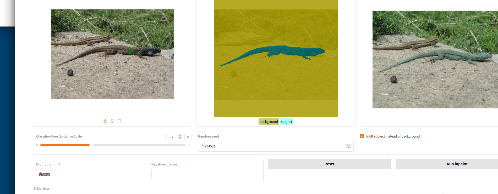
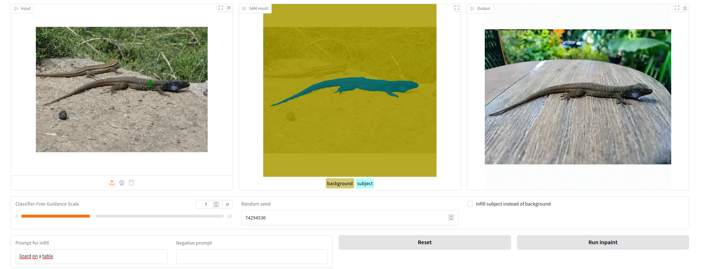
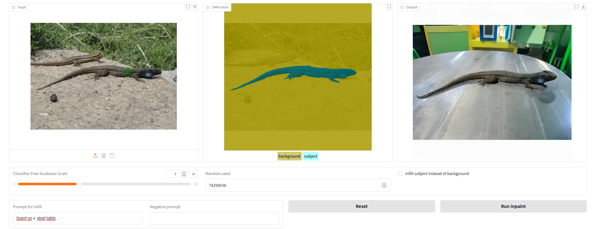
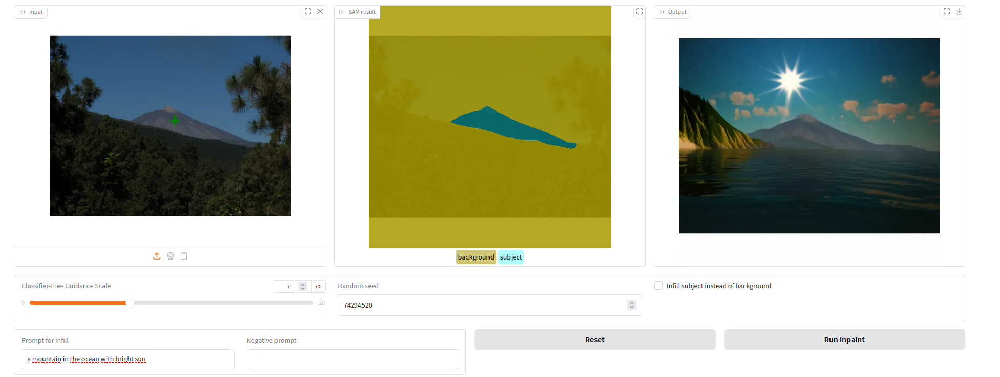

# AI Photo Editing with Inpainting

For Udacity course "Generative AI"

## Project

This project should demonstate a simple AI photo editing tool where the user can select an object in an image and then change the object or the background with an AI prompt.

## Pipeline

- Use a SAM model to segment the image in object and background
- Get the user prompt and negative prompt
- Call a diffusion model for image filling with the original image, the mask from the SAM model, the positive and negative prompt

## Results

### Lizard

#### Lizard replaced with a dragon

#### lizard on a table

#### lizard on a steel table

### Teide (mountain)

#### Teide in the ocean

#### lizard on a table

#### lizard on a steel table

