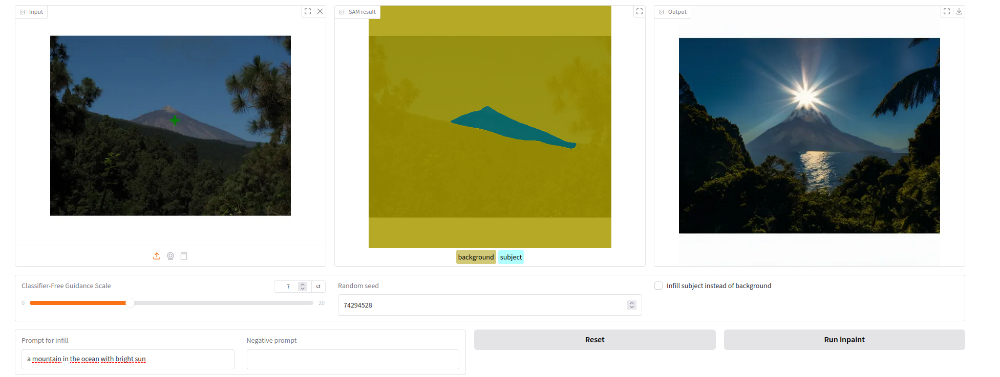
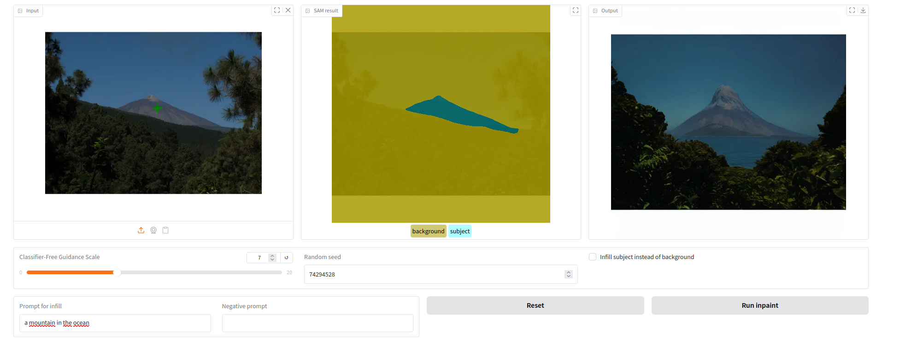
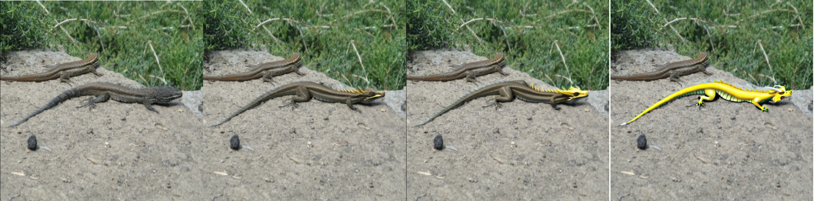

# AI Photo Editing with Inpainting

For Udacity course "Generative AI", based on (https://github.com/udacity/Computer-Vision-and-Generative-AI-Project).

The library app.py was modified to run with gradio 4 since the old versions from the original project don't runs with modern GPU hardware.

## Project

This project should demonstate a simple AI photo editing tool where the user can select an object in an image and then change the object or the background with an AI prompt.

## Pipeline

- Use a SAM model to segment the image in object and background
- Get the user prompt and negative prompt
- Call a diffusion model for image filling with the original image, the mask from the SAM model, the positive and negative prompt

## Results

### Lizard

#### Lizard replaced with a dragon

#### lizard on a table

#### lizard on a steel table

### Teide (mountain)

#### Teide in the ocean with sun

#### Teide modified with sun in ocean with wooden island foreground

#### Teide modified without sun with wooden island foreground

## Parameter effect

### The diffusion model is tested with different "Classifier-Free Guidance Scales"

Value from left to right 1, 7, 14, 50

It can be seen that the model changes the mask with in image that looks increasingly like the text prompt when the parameter is increased.

