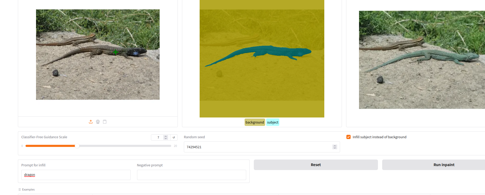

# AI Photo Editing with Inpainting

For Udacity course "Generative AI", based on (https://github.com/udacity/Computer-Vision-and-Generative-AI-Project).

The library app.py was modified to run with gradio 4 since the old versions from the original project don't runs with modern GPU hardware.

## Project

This project should demonstate a simple AI photo editing tool where the user can select an object in an image and then change the object or the background with an AI prompt.

## Pipeline

- Use a SAM model to segment the image in object and background
- Get the user prompt and negative prompt
- Call a diffusion model for image filling with the original image, the mask from the SAM model, the positive and negative prompt

## Results

### Lizard

#### Lizard replaced with a dragon

#### lizard on a table

#### lizard on a steel table

### Teide (mountain)

#### Teide in the ocean with sun

#### Teide modified with sun in ocean with wooden island foreground

#### Teide modified without sun with wooden island foreground

## Parameter effect

### The diffusion model is tested with different "Classifier-Free Guidance Scales"

Value from left to right 1, 7, 14, 50

It can be seen that the model changes the mask with in image that looks increasingly like the text prompt when the parameter is increased.

## Prompt engineering

A scene should be created from an image. Multiple prompts are tried to get a satisfing solution. Many of the prompts gave strange results, following is a sequence of prompts that lead to a usable result.

Scene: a cat on a branch over a street with a knight riding a horse

Base image

Prompt 1: cat sitting on a tree branch

Prompt 1: cat sitting on a tree branch over a medieval street

Prompt 1: cat sitting on a tree branch over a medieval street with horses

Prompt 1: cat sitting on a tree branch over a medieval street with a knight on a horse

## Iterative changes

From the image with the Teide, another scene should be created:
- Teide should be a erupting vulcano
- The sky is dark with lightning
- Teide in surrounded by an ocean which is green glowing
- In from of Teide there is an island
- At the island there is a platform with dancing aliens

After every prompt, the result is the source for the next prompt.

### Original Image

### First prompt
- Prompt: a green ocean with an island, a dark sky with lightning
- Mask: Teide
- Target: background

### Second prompt
- Prompt: a erupting vulcano with orange and red lava
- Mask: background
- Target: Teide

### Third prompt
- Prompt: aliens dancing on a platform surrounded by a green glowing ocean
- Mask: island, vulcano, sky
- Target: Ocean

-Different random number generator seed
